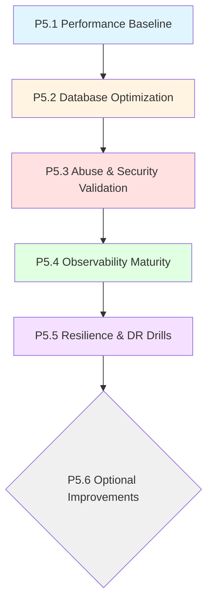
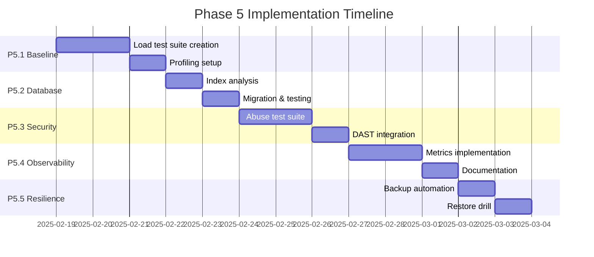

# Phase 5 Roadmap: Performance, Resilience & Advanced Security

**Project:** DPT-Local Teknokent Management System  
**Status:** PLAN MODE - Awaiting Approval  
**Date:** 2025-02-18  
**Prerequisites:** Phase 4 Complete (151 tests passing, coverage thresholds met, backup/restore functional)

---

## Executive Summary

Phase 5 is a **production maturity layer** that transforms DPT-Local from a functional application into a production-ready system. This phase focuses on measurable improvements through baselining, optimization validation, security hardening, and operational discipline.

### Key Principles

1. **Measure First, Optimize Second** - No blind optimizations; all changes justified by metrics
2. **Non-Breaking** - Zero API contract changes, zero UI redesigns
3. **Small, Reversible Steps** - Each task can be independently rolled back
4. **Evidence-Based** - Before/after measurements for all changes

---

## Phase 5 Execution Order



---

## P5.1 Performance Baseline (MANDATORY)

### Goal
Establish reproducible performance measurements and profiling capabilities before any optimization work.

### Exact Files to Touch

| File | Action | Purpose |
|------|--------|---------|
| `server/scripts/perf/load-test.js` | Create | k6/autocannon load test script |
| `docs/performance-baseline.md` | Create | Baseline documentation |
| `server/scripts/perf/profile-checklist.md` | Create | Profiling SOP |
| `.github/workflows/perf-baseline.yml` | Create | CI job for baseline tests |

### Acceptance Criteria

1. **Load Test Suite**
   - Tests all critical endpoints: auth, companies list, leases list, units assign, dashboard
   - Target metrics defined:
     - 50 RPS sustained
     - p95 latency < 200ms
     - p99 latency < 500ms
   - Dataset sizing assumptions documented (e.g., 1000 companies, 5000 units)

2. **Profiling Checklist**
   - Node.js CPU profiling instructions (clinic.js or 0x)
   - PostgreSQL slow query log configuration
   - EXPLAIN ANALYZE workflow for query analysis

3. **Baseline Report**
   - Current performance numbers documented
   - Bottlenecks identified (top 5 slow queries)
   - Regression test can be run on demand

### Implementation Details

#### Load Test Script Structure
```javascript
// server/scripts/perf/load-test.js
import http from 'k6/http';
import { check, sleep } from 'k6';

export const options = {
  stages: [
    { duration: '30s', target: 10 },  // Ramp up
    { duration: '1m', target: 50 },    // Sustained load
    { duration: '30s', target: 0 },    // Ramp down
  ],
  thresholds: {
    http_req_duration: ['p(95)<200'],
    http_req_failed: ['rate<0.01'],
  },
};

const BASE_URL = __ENV.API_URL || 'http://localhost:3001';

export default function() {
  // Test scenarios for each endpoint
  // Auth, Companies, Leases, Units, Dashboard
}
```

#### Profiling Checklist
```markdown
# Node.js CPU Profile
1. npm install -g clinic
2. clinic doctor -- npm start
3. Load test with autocannon
4. Analyze output

# PostgreSQL Slow Query Log
1. ALTER SYSTEM SET log_min_duration_statement = 100;
2. SELECT pg_reload_conf();
3. Review logs for queries > 100ms
4. Run EXPLAIN ANALYZE on slow queries
```

### Regression Risk
**Very Low** - Read-only measurements, no code changes to application.

### Rollback Plan
Delete the test scripts; no application changes to revert.

---

## P5.2 Database Optimization (MANDATORY)

### Goal
Implement targeted database indexes based on actual query patterns from baseline analysis.

### Exact Files to Touch

| File | Action | Purpose |
|------|--------|---------|
| `server/src/db/migrations/004_add_phase5_indexes.sql` | Create | Additional indexes |
| `server/src/db/migrations/MIGRATION_LOG.md` | Update | Document new migration |
| `docs/database-optimization.md` | Create | Before/after analysis |

### Acceptance Criteria

1. **New Indexes**
   - Partial indexes for soft-delete patterns: `WHERE deleted_at IS NULL`
   - Composite indexes for common JOIN patterns
   - Covering indexes for dashboard queries
   - All indexes are idempotent (CREATE IF NOT EXISTS)

2. **Performance Validation**
   - Before/after query timing documented
   - EXPLAIN ANALYZE shows index usage
   - No regression in write performance

3. **Migration Discipline**
   - Migration tested on staging first
   - Rollback SQL documented
   - Migration duration < 2 minutes

### Proposed Indexes (Based on Actual Queries)

```sql
-- Migration 004: Phase 5 Performance Indexes

-- Covering index for dashboard campus breakdown
CREATE INDEX IF NOT EXISTS idx_dashboard_campus_breakdown 
ON blocks(campus_id) 
INCLUDE (max_area_sqm, deleted_at);

-- Covering index for unit assignment queries
CREATE INDEX IF NOT EXISTS idx_units_assignment 
ON units(block_id, floor, number) 
WHERE deleted_at IS NULL;

-- Partial index for active companies with sector
CREATE INDEX IF NOT EXISTS idx_companies_active_sector 
ON companies(sector, name) 
WHERE deleted_at IS NULL;

-- Index for audit log pagination with user filtering
CREATE INDEX IF NOT EXISTS idx_audit_logs_user_timestamp 
ON audit_logs(user_name, timestamp DESC);

-- Index for lease end date queries (expiring soon)
CREATE INDEX IF NOT EXISTS idx_leases_expiring 
ON leases(end_date) 
WHERE deleted_at IS NULL AND end_date >= CURRENT_DATE;

-- Covering index for company search
CREATE INDEX IF NOT EXISTS idx_companies_search 
ON companies(name, manager_name, sector) 
WHERE deleted_at IS NULL;
```

### Regression Risk
**Low** - Indexes only improve read performance; may slow writes slightly.

### Rollback Plan
```sql
DROP INDEX CONCURRENTLY IF EXISTS idx_dashboard_campus_breakdown;
DROP INDEX CONCURRENTLY IF EXISTS idx_units_assignment;
-- ... etc
```

---

## P5.3 Abuse & Security Validation (MANDATORY)

### Goal
Implement automated security validation in CI to catch regressions and abuse vulnerabilities.

### Exact Files to Touch

| File | Action | Purpose |
|------|--------|---------|
| `.github/workflows/security-scan.yml` | Create | CI security job |
| `server/tests/security/abuse.test.ts` | Create | Rate limit abuse tests |
| `server/tests/security/rbac.test.ts` | Create | RBAC enforcement tests |
| `server/tests/security/dast-scan.sh` | Create | OWASP ZAP baseline |
| `docs/security-validation.md` | Create | Security test documentation |

### Acceptance Criteria

1. **Rate Limit Abuse Tests**
   - Verify login limiter triggers after 5 failed attempts
   - Verify global rate limit triggers after 100 requests/15min
   - Test that successful login requests are not counted
   - All tests automated and run in CI

2. **RBAC Security Tests**
   - VIEWER role cannot POST/PUT/DELETE (403 expected)
   - MANAGER role cannot delete users (403 expected)
   - Unauthenticated requests rejected (401 expected)
   - Cross-user access blocked (user A cannot access user B's resources)

3. **DAST Integration**
   - OWASP ZAP baseline scan runs in CI
   - Alerts on high/critical vulnerabilities
   - False positives documented and excluded

### Implementation Details

#### Abuse Test Structure
```typescript
// server/tests/security/abuse.test.ts
describe('Rate Limiting', () => {
  it('should block login after 5 failed attempts', async () => {
    // Attempt 6 logins with wrong password
    // Verify 6th attempt returns 429
  });

  it('should not count successful login attempts', async () => {
    // 5 failed attempts + 1 successful + 1 more failed
    // Should NOT be rate limited
  });
});
```

#### DAST Scan Script
```bash
# server/tests/security/dast-scan.sh
docker pull owasp/zap2docker-stable
docker run -t owasp/zap2docker-stable zap-baseline.py \
  -t $TARGET_URL \
  -r report.html \
  -x zap-report.xml \
  --hook=/zap/hooks/
```

### Regression Risk
**None** - Tests only; no application changes.

### Rollback Plan
Remove CI job; delete test files.

---

## P5.4 Observability Maturity (MANDATORY)

### Goal
Establish logging retention strategy, implement basic metrics collection, and document alert thresholds.

### Exact Files to Touch

| File | Action | Purpose |
|------|--------|---------|
| `docs/observability.md` | Create | Observability strategy |
| `server/src/utils/metrics.ts` | Create | Metrics collection utility |
| `server/src/middleware/metricsMiddleware.ts` | Create | Request metrics |
| `server/src/index.ts` | Modify | Add metrics middleware |
| `server/src/utils/logger.ts` | Modify | Add retention config |

### Acceptance Criteria

1. **Logging Retention Strategy**
   - Document where logs live (file/destination)
   - Define retention periods (debug: 7d, info: 30d, error: 90d)
   - Specify rotation policy (size-based: 100MB per file)
   - Log format documented for external aggregators

2. **Request Metrics Collection**
   - Latency buckets: <50ms, <100ms, <200ms, <500ms, >500ms
   - Error rate by route
   - Request count per endpoint
   - Database query timing (at least per-route)

3. **Alert Thresholds Documented**
   - Error rate > 5% triggers alert
   - p95 latency > 500ms triggers alert
   - Database connection pool exhaustion triggers alert
   - Implementation notes per platform (local vs cloud)

### Implementation Details

#### Metrics Utility
```typescript
// server/src/utils/metrics.ts
import { logger } from './logger';

export interface Metrics {
  requestCount: number;
  errorCount: number;
  latencyBuckets: Record<string, number>;
  dbQueryTimes: number[];
}

class MetricsCollector {
  private metrics: Map<string, Metrics> = new Map();

  recordRequest(route: string, latency: number, isError: boolean) {
    // Record metrics
    logger.debug({ route, latency, isError }, 'Request metrics');
  }
}

export const metrics = new MetricsCollector();
```

#### Metrics Middleware
```typescript
// server/src/middleware/metricsMiddleware.ts
import { Request, Response, NextFunction } from 'express';
import { metrics } from '../utils/metrics';

export function metricsMiddleware(req: Request, res: Response, next: NextFunction) {
  const start = Date.now();
  
  res.on('finish', () => {
    const latency = Date.now() - start;
    const isError = res.statusCode >= 400;
    metrics.recordRequest(req.route?.path || req.path, latency, isError);
  });
  
  next();
}
```

### Regression Risk
**Very Low** - Only adds logging/metadata; minimal performance impact.

### Rollback Plan
Remove metrics middleware; revert logger changes.

---

## P5.5 Resilience & Disaster Recovery Drills (MANDATORY)

### Goal
Formalize backup operations and establish regular disaster recovery testing discipline.

### Exact Files to Touch

| File | Action | Purpose |
|------|--------|---------|
| `docs/disaster-recovery-runbook.md` | Create | DR procedures |
| `server/src/scripts/scheduled-backup.sh` | Create | Automated backup script |
| `server/src/scripts/restore-drill-test.sh` | Create | Restore verification |
| `.github/workflows/backup-test.yml` | Create | Monthly CI reminder |

### Acceptance Criteria

1. **Backup Schedule Formalized**
   - Daily automated backups documented
   - Backup retention policy (daily: 30d, weekly: 12w, monthly: 12m)
   - Backup encryption at rest (or document local-only limitation)
   - Backup verification (restore test every 30 days)

2. **Restore Drill Runbook**
   - Step-by-step restore procedure
   - Time-to-restore measurement (target: <15 minutes)
   - Verification checklist (data integrity, smoke tests)
   - Rollback procedure if restore fails

3. **Monthly Drill Discipline**
   - Checklist that must be executed monthly
   - Results logged (restore time, issues found)
   - CI workflow as monthly reminder
   - Sign-off required after each drill

### Implementation Details

#### Scheduled Backup Script
```bash
#!/bin/bash
# server/src/scripts/scheduled-backup.sh

BACKUP_DIR="/var/backups/dpt-local"
TIMESTAMP=$(date +%Y%m%d_%H%M%S)
RETENTION_DAYS=30

# Create backup
npm run backup -- --output="$BACKUP_DIR/backup_$TIMESTAMP.sql"

# Compress
gzip "$BACKUP_DIR/backup_$TIMESTAMP.sql"

# Clean old backups
find "$BACKUP_DIR" -name "backup_*.sql.gz" -mtime +$RETENTION_DAYS -delete

# Log
echo "Backup completed: backup_$TIMESTAMP.sql.gz"
```

#### Restore Drill Test
```bash
#!/bin/bash
# server/src/scripts/restore-drill-test.sh

START_TIME=$(date +%s)

echo "Starting restore drill..."

# 1. Create test database
createdb dpt_restore_test

# 2. Restore latest backup
gunzip < /var/backups/dpt-local/latest.sql.gz | psql dpt_restore_test

# 3. Run verification queries
RESULT=$(psql dpt_restore_test -tAc "SELECT COUNT(*) FROM companies WHERE deleted_at IS NULL")

# 4. Clean up
dropdb dpt_restore_test

END_TIME=$(date +%s)
DURATION=$((END_TIME - START_TIME))

echo "Restore drill completed in $DURATION seconds. Companies: $RESULT"
```

#### Runbook Template
```markdown
# Disaster Recovery Runbook

## Restore Procedure

1. **Stop Application**
   ```bash
   systemctl stop dpt-local-api
   ```

2. **Identify Backup to Restore**
   ```bash
   ls -lt /var/backups/dpt-local/ | head -5
   ```

3. **Drop Existing Database**
   ```bash
   psql -c "DROP DATABASE IF EXISTS appdb_backup;"
   ```

4. **Restore from Backup**
   ```bash
   gunzip < backup_YYYYMMDD.sql.gz | psql appdb
   ```

5. **Verify Data Integrity**
   - Run smoke tests
   - Verify row counts
   - Check audit log consistency

6. **Start Application**
   ```bash
   systemctl start dpt-local-api
   ```

## Verification Checklist

- [ ] Companies count matches expected
- [ ] Units assigned correctly
- [ ] Dashboard metrics calculate
- [ ] Audit logs present
- [ ] No orphaned records

## Time-to-Restore Target

- **Target:** < 15 minutes
- **Actual:** ___ minutes (record after drill)
```

### Regression Risk
**None** - Documentation and scripts only.

### Rollback Plan
Delete scripts and documentation.

---

## P5.6 Optional Improvements (ONLY IF JUSTIFIED)

### Entry Criteria
Must complete ALL mandatory steps (P5.1-P5.5) AND have baseline measurements showing clear need.

### P5.6.1 Redis Caching for Hot Reads

**Trigger:** Dashboard or list endpoints show p95 > 200ms under normal load.

**Implementation:**
- Cache dashboard metrics for 60 seconds
- Cache company list for 300 seconds
- Invalidate on mutations (POST/PUT/DELETE)

**Files:**
- `server/src/cache/redisClient.ts` - Redis connection
- `server/src/middleware/redisCache.ts` - Cache middleware
- `docker-compose.yml` - Add Redis service

**Acceptance:**
- Cache hit rate > 70%
- p95 latency improvement > 50%

### P5.6.2 Background Job Queue

**Trigger:** Long-running operations (>5s) block request handling.

**Implementation:**
- Use BullMQ for job queue
- Move report generation, bulk operations to background
- Add job status endpoints

**Files:**
- `server/src/queues/worker.ts` - Job processor
- `server/src/queues/jobQueue.ts` - Queue setup
- `server/src/routes/jobs.ts` - Job status API

### P5.6.3 Read Replicas

**Trigger:** Read-heavy workload causes primary database saturation.

**Implementation:**
- Configure read replica connection
- Route SELECT queries to replica
- Write/transaction queries to primary

**Files:**
- `server/src/db/read-replica.ts` - Replica pool
- `server/src/routes/*.ts` - Update query routing

**DO NOT IMPLEMENT** unless baseline shows >500 RPS sustained.

---

## Scope Guardrails (Do Not Do List)

| Item | Reason |
|------|--------|
| **NO endpoint URL changes** | Breaking contract |
| **NO response shape changes** | Breaking contract |
| **NO UI redesign** | Out of scope |
| **NO frontend framework changes** | Out of scope |
| **NO database migration to new engine** | Out of scope |
| **NO Kubernetes** | Over-engineering for current scale |
| **NO service mesh** | Over-engineering for current scale |
| **NO distributed tracing** | Overkill for monolithic app |
| **NO Redis queue without proven need** | YAGNI principle |
| **NO read replicas without saturation evidence** | YAGNI principle |

---

## Implementation Timeline Overview



---

## Success Metrics

| Metric | Baseline | Target | Measurement Method |
|--------|----------|--------|-------------------|
| **p95 API Latency** | TBD | < 200ms | k6 load test |
| **Dashboard Load Time** | TBD | < 500ms | k6 dashboard endpoint |
| **Database Query Time (p95)** | TBD | < 50ms | EXPLAIN ANALYZE |
| **Test Suite Runtime** | ~7s | < 10s | npm test |
| **Security Test Pass Rate** | N/A | 100% | CI security job |
| **Restore Time** | TBD | < 15min | Restore drill |
| **Cache Hit Rate** (if Redis) | N/A | > 70% | Redis stats |

---

## Risk Assessment

| Workstream | Risk Level | Mitigation |
|------------|------------|------------|
| P5.1 Baseline | Very Low | Read-only measurements |
| P5.2 Database | Low | Test on staging, index CONCURRENTLY |
| P5.3 Security | None | Tests only |
| P5.4 Observability | Very Low | Minimal overhead |
| P5.5 Resilience | None | Scripts and docs only |
| P5.6 Redis | Medium | Proper cache invalidation testing |
| P5.6 Job Queue | Medium | Dead letter handling |
| P5.6 Read Replicas | High | Not recommended without need |

---

## Pre-Implementation Checklist

Before executing Phase 5:

- [ ] Phase 4 completion verified (151 tests passing)
- [ ] Staging environment available
- [ ] Database backup verified
- [ ] Team review of roadmap completed
- [ ] Approval received from stakeholders
- [ ] Timeline allocated for each workstream

---

## Sign-Off

**Status:** 📋 PLAN AWAITING APPROVAL

This roadmap is a planning document. No implementation should begin until approved.

---

**Document Version:** 1.0  
**Last Updated:** 2025-02-18  
**Author:** Phase 5 Architecture Planning
