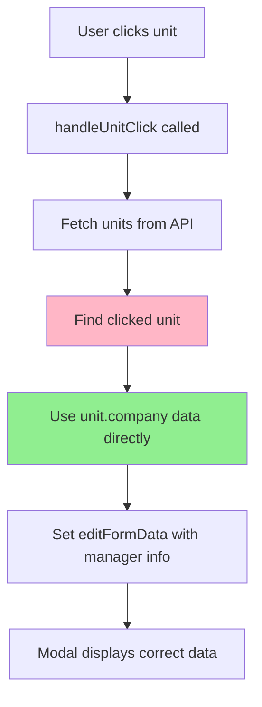

# Fix Manager Information Display in PhysicalStructure Page

## Problem Statement

The PhysicalStructure page's unit detail modal has three issues:
1. **Manager information fields are empty**: YÖNETİCİ, TELEFON, E-POSTA fields show no data
2. **Company name shows unit number**: Displays "No.52" instead of actual company name
3. **Delay issue when switching companies**: Briefly shows previous company's data before updating

## Root Cause Analysis

### Current Implementation Issues

The `handleUnitClick` function in `PhysicalStructure.tsx` (lines 727-762) uses this approach:

```typescript
const handleUnitClick = async (unitId: string) => {
    const blockUnits = await api.getUnits(selectedBlockId);
    const unit = blockUnits.find(u => u.id === unitId);
    if (!unit) return;
    const company = allCompanies.find(c => c.id === unit.companyId); // ❌ PROBLEM HERE
    // ...
    setEditFormData({
        companyName: company?.name || unit.number, // Falls back to unit.number
        managerName: company?.managerName || '', // Empty because allCompanies doesn't have it
        managerPhone: company?.managerPhone || '',
        managerEmail: company?.managerEmail || '',
        // ...
    });
};
```

### Why This Fails

1. **`allCompanies` state limitation**: Populated from `api.getCompanies()` which returns paginated data that may not include all manager fields
2. **Units endpoint already has the data**: The `/units` endpoint returns company details via LEFT JOIN including:
   - `company_name`
   - `company_manager_name`
   - `company_manager_phone`
   - `company_manager_email`
   - `company_employee_count`
   - `company_business_areas`

3. **TypeScript interface mismatch**: The `Unit` interface doesn't include the `company` property that the API returns

## Solution Architecture



## Implementation Plan

### Step 1: Update TypeScript Interface

**File**: `types.ts`

Add `company` property to the `Unit` interface:

```typescript
export interface Unit {
  id: string;
  blockId: string;
  number: string;
  floor: string;
  areaSqM: number;
  status: UnitStatus;
  isMaintenance: boolean;
  companyId?: string;
  reservationCompanyId?: string;
  reservationFee?: number;
  reservedAt?: string;
  company?: {  // ← Add this
    id: string;
    name: string;
    sector: string;
    managerName: string;
    managerPhone: string;
    managerEmail: string;
    employeeCount: number;
    businessAreas: string[];
  } | null;
}
```

### Step 2: Fix handleUnitClick Function

**File**: `pages/PhysicalStructure.tsx`

Replace the `allCompanies.find()` approach with direct use of `unit.company`:

```typescript
const handleUnitClick = async (unitId: string) => {
    const blockUnits = await api.getUnits(selectedBlockId);
    const unit = blockUnits.find(u => u.id === unitId);
    if (!unit) return;
    
    // ✅ Use company data from unit response (already includes manager info)
    const company = unit.company;
    
    setEditingUnitId(unitId);
    setIsEditMode(false);

    const allLeases = await api.getAllLeaseDetails();
    const lease = allLeases.find(l => l.unit.id === unitId)?.lease;
    const monthlyRent = lease?.monthlyRent || 0;

    const campusBlocks = await api.getBlocks(selectedCampus?.id);
    const block = campusBlocks.find(b => b.id === selectedBlockId);
    const defaultFee = block?.defaultOperatingFee ?? 400;
    const operatingFee = lease?.operatingFee ?? defaultFee;

    fixedUnitPriceRef.current = unit.areaSqM > 0 ? monthlyRent / unit.areaSqM : 0;

    setEditFormData({
        areaSqM: unit.areaSqM,
        companyName: company?.name || unit.number,
        sector: company?.sector || 'Belirtilmedi',
        managerName: company?.managerName || '',
        managerPhone: company?.managerPhone || '',
        managerEmail: company?.managerEmail || '',
        employeeCount: company?.employeeCount || 0,
        monthlyRent: monthlyRent,
        operatingFee: operatingFee,
        startDate: isoToDisplay(lease?.startDate || ''),
        endDate: isoToDisplay(lease?.endDate || '')
    });
    setEditError(null);
};
```

### Step 3: Verify No Delay Issue

The delay issue occurs because:
1. Old code fetched fresh data but used stale `allCompanies` state
2. New code uses data directly from the fresh API response

This eliminates the delay because:
- `unit.company` comes from the same API call that fetches the unit
- No dependency on stale state
- Data is immediately available

## Testing Checklist

- [ ] Manager name displays correctly in modal
- [ ] Manager phone displays correctly in modal
- [ ] Manager email displays correctly in modal
- [ ] Company name shows actual name (not "No.52")
- [ ] No delay when switching between companies
- [ ] Data persists correctly when closing and reopening modal
- [ ] Edit mode still works correctly
- [ ] TypeScript compilation succeeds

## Files to Modify

1. `types.ts` - Add `company` property to `Unit` interface
2. `pages/PhysicalStructure.tsx` - Update `handleUnitClick` function

## Expected Outcome

After implementation:
- Manager information fields will be populated with data from the database
- Company names will display correctly instead of unit numbers
- No delay when switching between companies in the modal
- All data comes from the single, consistent units API response
