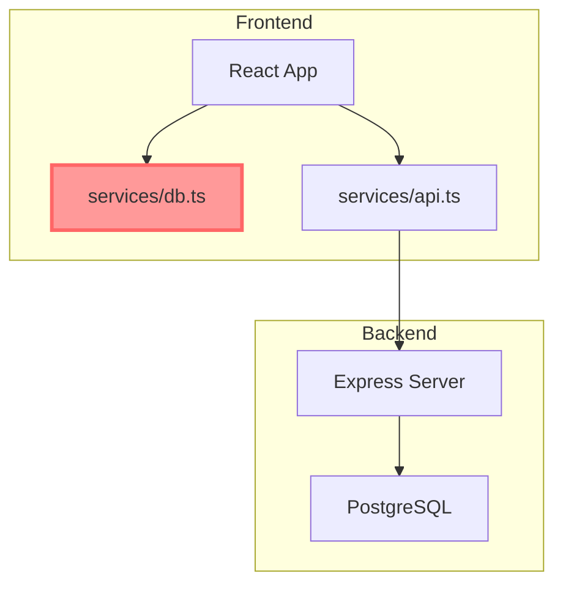
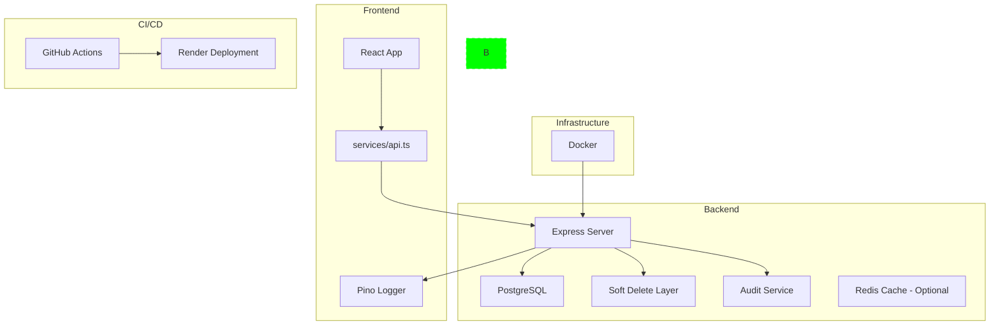
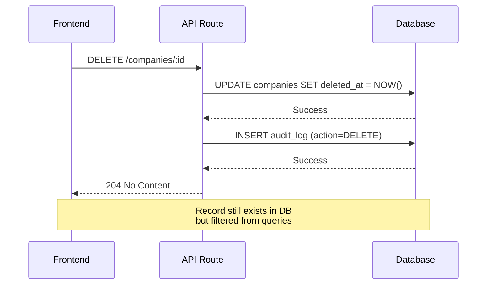

# Phase 3: Production-Grade Architecture Plan (REVISED)

## Executive Summary

This document outlines the REVISED architecture plan for Phase 3 of the LeaseGuard system upgrade, moving from "secure baseline" to "production-grade" architecture. The plan addresses 7 core areas while maintaining strict frontend protection rules.

**Current State Analysis:**
- Backend: Express.js + PostgreSQL with comprehensive REST API
- Frontend: React + Vite with legacy in-memory database ([`services/db.ts`](../services/db.ts))
- Deployment: Render platform
- Authentication: JWT-based with role-based access control

**NON-NEGOTIABLE Constraints:**
- NO endpoint URL changes
- NO response shape breaking changes
- NO UI redesign
- Preserve existing theme/layout
- Minimal diffs, staged commits

**IMPORTANT SCOPE ADJUSTMENTS:**
1. **Rollback Feature**: OUT OF SCOPE for Phase 3 (deferred to Phase 4+)
2. **Dashboard Live Updates**: Event-driven refetch only (NO WebSockets)
3. **Pagination**: Preserve array response bodies, use headers for metadata
4. **API Compatibility Layer**: Temporary shim for 4 pages only, removed after migration

---

## 1. Risk Map (REVISED)

### High Risk Areas

| Area | Risk Level | Description | Mitigation |
|------|------------|-------------|------------|
| Legacy db.ts Removal | **CRITICAL** | 4 pages directly import db.ts with 20+ method calls | Create temporary API adapter, migrate incrementally |
| Dashboard Live Updates | **MEDIUM** | Uses observer pattern (db.subscribe) for real-time updates | Event-driven refetch after CRUD actions |
| Audit Rollback Feature | **LOW** | Frontend has rollback UI but backend doesn't support | Disable rollback UI via feature flag (Phase 3) |
| Soft Delete Migration | **MEDIUM** | Requires schema changes and query updates | Use database migration scripts, add WHERE clauses |
| Test Coverage | **MEDIUM** | Zero existing tests | Start with critical path tests first |

### Medium Risk Areas

| Area | Risk Level | Description | Mitigation |
|------|------------|-------------|------------|
| Logging Replacement | **MEDIUM** | Console.log scattered across codebase | Use find-replace with Pino, add log levels |
| CI/CD Pipeline | **LOW** | No existing automation | Start with basic lint/test/build pipeline |
| Docker Support | **LOW** | New capability, no existing dependency | Create multi-stage Dockerfile separately |

---

## 2. Migration Order (REVISED)

### Stage A: Legacy Frontend DB Migration (Foundation)

**Why First:** This is the foundation. All other stages depend on having a clean API-only architecture.

**Acceptance Criteria:**
- All 4 pages use API calls instead of db.ts
- No direct imports of services/db.ts remain
- All CRUD operations work via API
- Rollback UI is disabled (feature flag)
- Dashboard updates via event-driven refetch
- Response shapes match existing expectations

**Steps:**
1. Create temporary API adapter in [`services/api.ts`](../services/api.ts) (methods used by 4 pages only)
2. Add missing backend endpoints (document operations, scores)
3. Add rollback stub endpoints (return "not implemented" message)
4. Migrate [`pages/AuditLogs.tsx`](../pages/AuditLogs.tsx) (simplest, ~670 lines)
5. Migrate [`pages/Dashboard.tsx`](../pages/Dashboard.tsx) (~800 lines, event-driven refetch)
6. Migrate [`pages/LeasingManagement.tsx`](../pages/LeasingManagement.tsx) (~2300 lines)
7. Migrate [`pages/PhysicalStructure.tsx`](../pages/PhysicalStructure.tsx) (~2200 lines, most complex)
8. Remove [`services/db.ts`](../services/db.ts)
9. Remove temporary API adapter shims

**Regression Zones:**
- Campus/Block/Unit CRUD operations
- Company assignment workflows
- Dashboard metrics calculations
- Audit log display and filtering
- Document upload/download flows

### Stage B: Soft Delete Architecture

**Why Second:** Requires schema changes but no frontend impact.

**Steps:**
1. Add `deleted_at` columns to all tables
2. Create database migration script
3. Update all SELECT queries to filter `WHERE deleted_at IS NULL`
4. Implement "restore" endpoints
5. Update DELETE operations to set `deleted_at` instead of removing rows

**Affected Tables:**
- campuses
- blocks
- units
- companies
- leases
- company_score_entries
- company_documents

### Stage C: Audit Tamper Protection (REVISED)

**Why Third:** Security enhancement with minimal frontend impact.

**Scope Change:** Full rollback implementation deferred to Phase 4+

**Steps:**
1. Remove DELETE/UPDATE routes from [`server/src/routes/audit.ts`](../server/src/routes/audit.ts)
2. Add append-only constraint at database level (trigger)
3. Keep rollback stub endpoints (return "coming in Phase 4" message)
4. Frontend rollback UI already disabled in Stage A

### Stage D: Structured Logging

**Why Fourth:** Non-breaking improvement to observability.

**Steps:**
1. Install and configure Pino
2. Create logger utility in [`server/src/utils/logger.ts`](../server/src/utils/logger.ts)
3. Replace all console.log with logger calls
4. Add request ID middleware for traceability
5. Configure log rotation and retention

### Stage E: Basic Test Infrastructure

**Why Fifth:** Quality assurance for production readiness.

**Steps:**
1. Install Jest + Supertest
2. Create test configuration
3. Write tests for:
   - Authentication flow
   - Company CRUD operations
   - Lease creation/termination
   - Dashboard metrics
4. Set up test database

### Stage F: CI/CD Minimal Pipeline

**Why Sixth:** Automation for deployment safety.

**Steps:**
1. Create `.github/workflows/ci.yml`
2. Configure: install → lint → test → build
3. Add deployment step for Render
4. Set up branch protection rules

### Stage G: Docker Support

**Why Last:** Optional deployment alternative.

**Steps:**
1. Create multi-stage Dockerfile
2. Create docker-compose.yml
3. Add development and production configurations
4. Document Docker usage

---

## 3. Stage A: File Change List (Detailed)

### Backend Changes

**New Endpoints to Add:**
- [`server/src/routes/companies.ts`](../server/src/routes/companies.ts)
  - `POST /:id/documents` - Add document to company
  - `DELETE /:id/documents/:docName` - Delete document from company
  - `POST /:id/scores` - Add score entry to company
  - `DELETE /:id/scores/:scoreId` - Delete score entry from company

- [`server/src/routes/audit.ts`](../server/src/routes/audit.ts)
  - `GET /:logId/rollback-preview` - Stub endpoint (returns "Phase 4" message)
  - `POST /:logId/rollback` - Stub endpoint (returns "Phase 4" message)

**Response Shape Requirements:**
- `/companies` - Keep existing `{ data, pagination }` wrapper
- `/leases/details` - Return array directly (no wrapper)
- `/audit` - Keep existing `{ data, pagination }` wrapper
- `/campuses`, `/blocks`, `/units` - Return arrays directly (no wrapper)

### Frontend Changes

**API Client Updates:**
- [`services/api.ts`](../services/api.ts)
  - Update return types to match backend responses
  - Add stub methods for rollback (return resolved promises with message)
  - Add document/score methods

**Page Migrations:**

1. **[`pages/AuditLogs.tsx`](../pages/AuditLogs.tsx)** (~670 lines)
   - Replace `db.getLogs()` with `api.getLogs()`
   - Replace `db.getRollbackPreview()` with stub
   - Replace `db.rollbackTransaction()` with stub
   - Add loading/error states
   - Disable rollback button (feature flag)

2. **[`pages/Dashboard.tsx`](../pages/Dashboard.tsx)** (~800 lines)
   - Replace `db.subscribe()` with event-driven refetch
   - Replace `db.getAllLeaseDetails()` with `api.getAllLeaseDetails()`
   - Replace `db.getCampuses()` with `api.getCampuses()`
   - Replace `db.getDashboardMetrics()` with `api.getDashboardMetrics()`
   - Add loading/error states
   - Refetch data after CRUD operations (via callback or event)

3. **[`pages/LeasingManagement.tsx`](../pages/LeasingManagement.tsx)** (~2300 lines)
   - Replace all `db` method calls with `api` equivalents
   - Methods used: `getAllLeaseDetails()`, `getCompanies()`, `registerCompany()`, `updateCompany()`, `addCompanyScore()`, `deleteCompanyScore()`, `addDocument()`, `deleteDocument()`, `updateLeaseDates()`, `updateLease()`, `deleteLease()`, `getSectors()`, `addSector()`, `deleteSector()`
   - Add loading/error states
   - Convert sync calls to async/await

4. **[`pages/PhysicalStructure.tsx`](../pages/PhysicalStructure.tsx)** (~2200 lines)
   - Replace all `db` method calls with `api` equivalents
   - Methods used: `getCampuses()`, `getBlocks()`, `getUnits()`, `getCompanies()`, `getAllLeaseDetails()`, `getSectors()`, `addCampus()`, `deleteCampus()`, `addBlock()`, `assignCompanyToFloor()`, `removeAllocation()`, `updateUnitAndCompany()`, `updateLease()`, `updateLeaseDates()`, `updateBlock()`
   - Add loading/error states
   - Convert sync calls to async/await
   - Handle `sanitizeInput` utility (move to utils or keep in api)

**To Remove:**
- [`services/db.ts`](../services/db.ts) - After all 4 pages are migrated

---

## 4. Files to Modify (Other Stages)

### Stage A: Legacy DB Migration

**Frontend Files (4 pages):**
- [`pages/PhysicalStructure.tsx`](../pages/PhysicalStructure.tsx) - ~2,200 lines
- [`pages/LeasingManagement.tsx`](../pages/LeasingManagement.tsx) - ~2,300 lines
- [`pages/Dashboard.tsx`](../pages/Dashboard.tsx) - ~800 lines
- [`pages/AuditLogs.tsx`](../pages/AuditLogs.tsx) - ~670 lines

**API Layer:**
- [`services/api.ts`](../services/api.ts) - Add missing methods

**Backend Routes (may need additions):**
- [`server/src/routes/audit.ts`](../server/src/routes/audit.ts) - Add rollback endpoints
- [`server/src/routes/companies.ts`](../server/src/routes/companies.ts) - Add document endpoints
- [`server/src/routes/leases.ts`](../server/src/routes/leases.ts) - Add document endpoints

**To Remove:**
- [`services/db.ts`](../services/db.ts) - ~2,300 lines (after migration)

### Stage B: Soft Delete

**Database:**
- [`server/src/db/migrations/001_add_soft_delete.sql`](../server/src/db/migrations/001_add_soft_delete.sql) - NEW
- [`server/src/db/schema.sql`](../server/src/db/schema.sql) - Update schema

**Backend Routes (all need query updates):**
- [`server/src/routes/campuses.ts`](../server/src/routes/campuses.ts)
- [`server/src/routes/blocks.ts`](../server/src/routes/blocks.ts)
- [`server/src/routes/units.ts`](../server/src/routes/units.ts)
- [`server/src/routes/companies.ts`](../server/src/routes/companies.ts)
- [`server/src/routes/leases.ts`](../server/src/routes/leases.ts)

**New Routes:**
- [`server/src/routes/restore.ts`](../server/src/routes/restore.ts) - NEW

### Stage C: Audit Tamper Protection

**Backend:**
- [`server/src/routes/audit.ts`](../server/src/routes/audit.ts) - Remove DELETE/UPDATE
- [`server/src/db/schema.sql`](../server/src/db/schema.sql) - Add append-only trigger

### Stage D: Structured Logging

**Backend:**
- [`server/src/utils/logger.ts`](../server/src/utils/logger.ts) - NEW
- [`server/src/middleware/requestId.ts`](../server/src/middleware/requestId.ts) - NEW
- [`server/src/index.ts`](../server/src/index.ts) - Add logger middleware
- All route files - Replace console.log

### Stage E: Test Infrastructure

**New Files:**
- [`server/src/tests/auth.test.ts`](../server/src/tests/auth.test.ts) - NEW
- [`server/src/tests/companies.test.ts`](../server/src/tests/companies.test.ts) - NEW
- [`server/src/tests/leases.test.ts`](../server/src/tests/leases.test.ts) - NEW
- [`server/src/tests/dashboard.test.ts`](../server/src/tests/dashboard.test.ts) - NEW
- [`server/jest.config.js`](../server/jest.config.js) - NEW

### Stage F: CI/CD Pipeline

**New Files:**
- [`.github/workflows/ci.yml`](../.github/workflows/ci.yml) - NEW
- [`.github/workflows/deploy.yml`](../.github/workflows/deploy.yml) - NEW

### Stage G: Docker Support

**New Files:**
- [`Dockerfile`](../Dockerfile) - NEW
- [`docker-compose.yml`](../docker-compose.yml) - NEW
- [`.dockerignore`](../.dockerignore) - NEW

---

## 4. Expected Regression Zones

### Zone 1: Data Fetching Patterns

**Current Pattern:**
```typescript
// Direct synchronous access
const campuses = db.getCampuses();
```

**New Pattern:**
```typescript
// Async API call
const campuses = await api.getCampuses();
```

**Impact Areas:**
- Component initialization (useEffect dependencies)
- Loading states (need to add)
- Error handling (need to add)

### Zone 2: Live Updates (Dashboard)

**Current Pattern:**
```typescript
useEffect(() => {
  const unsubscribe = db.subscribe(() => {
    setMetrics(db.getDashboardMetrics());
  });
  return unsubscribe;
}, []);
```

**New Pattern Options:**
1. Polling: `setInterval(() => refetch(), 30000)`
2. WebSocket: Real-time server push
3. Event-based: Re-fetch on user actions

**Recommendation:** Start with polling (30s interval) for simplicity.

### Zone 3: Rollback Functionality

**Current State:** Frontend has rollback UI that calls `db.rollbackTransaction()`

**Issue:** Backend doesn't have rollback endpoints implemented

**Options:**
1. Implement full server-side rollback (complex)
2. Disable rollback UI temporarily
3. Implement "restore" via soft delete (simpler)

**Recommendation:** Implement restore via soft delete, mark rollback as "future enhancement".

### Zone 4: Type Mismatches

**Current:** db.ts returns rich objects with computed properties

**New:** API returns flat database rows

**Solution:** Ensure API responses match frontend type expectations exactly.

---

## 5. Architecture Diagrams

### Current Architecture



### Target Architecture (Phase 3 Complete)



### Data Flow: Soft Delete Pattern



---

## 6. Implementation Checklist

### Stage A: Legacy DB Migration
- [ ] Create API compatibility layer
- [ ] Add missing backend endpoints
- [ ] Migrate PhysicalStructure page
- [ ] Migrate LeasingManagement page
- [ ] Migrate Dashboard page (with polling)
- [ ] Migrate AuditLogs page
- [ ] Remove services/db.ts
- [ ] Test all CRUD operations
- [ ] Verify no console errors

### Stage B: Soft Delete
- [ ] Create migration script
- [ ] Add deleted_at columns
- [ ] Update all SELECT queries
- [ ] Change DELETE to UPDATE
- [ ] Create restore endpoints
- [ ] Test soft delete behavior
- [ ] Test restore functionality

### Stage C: Audit Tamper Protection
- [ ] Remove audit DELETE route
- [ ] Remove audit UPDATE route
- [ ] Add append-only trigger
- [ ] Document new audit pattern
- [ ] Update frontend if needed

### Stage D: Structured Logging
- [ ] Install pino
- [ ] Create logger utility
- [ ] Add request ID middleware
- [ ] Replace console.log in routes
- [ ] Configure log levels
- [ ] Test log output

### Stage E: Test Infrastructure
- [ ] Install Jest + Supertest
- [ ] Create jest.config.js
- [ ] Write auth tests
- [ ] Write company CRUD tests
- [ ] Write lease tests
- [ ] Write dashboard tests
- [ ] Achieve >70% coverage on critical paths

### Stage F: CI/CD Pipeline
- [ ] Create .github/workflows/ci.yml
- [ ] Configure lint step
- [ ] Configure test step
- [ ] Configure build step
- [ ] Add Render deployment
- [ ] Test pipeline end-to-end

### Stage G: Docker Support
- [ ] Create Dockerfile
- [ ] Create docker-compose.yml
- [ ] Create .dockerignore
- [ ] Test local build
- [ ] Test production build
- [ ] Document Docker usage

---

## 7. Success Criteria

Each stage is complete when:

1. **Stage A**: All pages work without db.ts, no console errors
2. **Stage B**: Deleted records are hidden, restore works
3. **Stage C**: Audit logs cannot be modified
4. **Stage D**: All logs are structured with request IDs
5. **Stage E**: At least 3 test suites pass
6. **Stage F**: Pipeline runs on every push
7. **Stage G**: Application runs in Docker

---

## 8. Rollback Strategy

If any stage fails:

1. **Stage A**: Keep db.ts as fallback, revert API changes
2. **Stage B**: Revert schema migration, restore old queries
3. **Stage C**: Restore audit routes
4. **Stage D**: Revert to console.log
5. **Stage E**: Disable tests temporarily
6. **Stage F**: Remove workflow files
7. **Stage G**: Remove Docker files

---

## 9. Next Steps

1. Review this architecture plan
2. Approve or request modifications
3. Begin Stage A implementation
4. Test and validate each stage before proceeding
