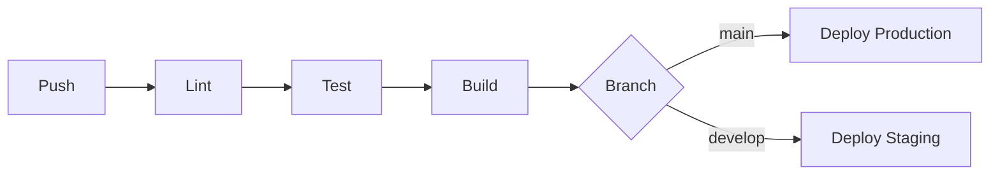
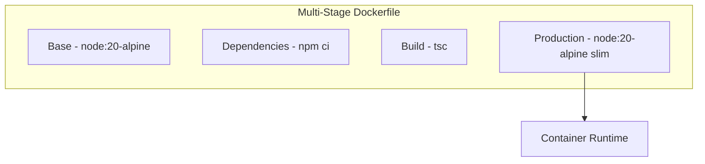

# Phase 3 Final Execution Plan
## Professional System Architecture Implementation

**Current Status: ~85% Complete**

### Completed Stages
- ✅ Stage A: Legacy DB Migration (services/db.ts removed, all pages using API)
- ✅ Stage B: Soft Delete Architecture (deleted_at columns, restore endpoints)
- ✅ Stage C: Audit Tamper Protection (append-only triggers)
- ✅ Stage D: Structured Logging (Pino logger, requestId middleware)
- ✅ Stage E: Test Infrastructure (Jest + Supertest, 18/18 tests passing)

---

## Remaining Tasks - Professional Implementation Plan

### Task 1: Complete Stage E - Dashboard & Leases API Tests

**Purpose:** Ensure comprehensive test coverage for critical business logic endpoints

**Implementation Approach:**
1. Dashboard API Tests (`src/tests/dashboard.test.ts`)
   - Test GET /api/dashboard with and without campusId filter
   - Validate response structure (totalArea, occupancyRate, sectorData, campusData)
   - Test SQL aggregate calculations
   - Verify caching behavior (semi-static cache)

2. Leases API Tests (`src/tests/leases.test.ts`)
   - Test GET /api/leases (pagination)
   - Test GET /api/leases/details (ExtendedLeaseData structure)
   - Test POST /api/leases (create lease)
   - Test PUT /api/leases/:id (update lease)
   - Test DELETE /api/leases/:id (soft delete)
   - Test PATCH /api/leases/:id/dates (date updates)
   - Test document uploads

**Test Coverage Target:** >70% on critical paths

---

### Task 2: Stage F - GitHub Actions CI/CD Pipeline

**Purpose:** Automated testing, linting, and deployment pipeline

**Architecture:**


**Implementation:**

**File:** `.github/workflows/ci.yml`
```yaml
name: CI Pipeline
on: [push, pull_request]
jobs:
  test:
    runs-on: ubuntu-latest
    services:
      postgres:
        image: postgres:15
        env:
          POSTGRES_DB: appdb_test
          POSTGRES_USER: app
          POSTGRES_PASSWORD: test
    steps:
      - uses: actions/checkout@v4
      - uses: actions/setup-node@v4
        with:
          node-version: '20'
      - name: Install dependencies
        working-directory: ./server
        run: npm ci
      - name: Run tests
        working-directory: ./server
        run: npm run test:ci
      - name: Build
        working-directory: ./server
        run: npm run build
```

**File:** `.github/workflows/deploy.yml`
```yaml
name: Deploy to Render
on:
  push:
    branches: [main]
jobs:
  deploy:
    runs-on: ubuntu-latest
    steps:
      - uses: actions/checkout@v4
      - name: Deploy Backend
        run: |
          curl -X POST \
            -H "Authorization: Bearer ${{ secrets.RENDER_API_KEY }}" \
            -H "Content-Type: application/json" \
            https://api.render.com/v1/services/${{ secrets.RENDER_SERVICE_ID }}/deploys \
            -d '{}'
```

---

### Task 3: Stage G - Docker Support

**Purpose:** Containerized deployment for consistent environments

**Architecture:**


**Implementation:**

**File:** `Dockerfile`
```dockerfile
# Build stage
FROM node:20-alpine AS builder
WORKDIR /app
COPY package*.json ./
RUN npm ci --only=production
COPY . .
RUN npm run build

# Production stage
FROM node:20-alpine AS production
WORKDIR /app
ENV NODE_ENV=production
COPY --from=builder /app/node_modules ./node_modules
COPY --from=builder /app/dist ./dist
COPY --from=builder /app/package.json ./
EXPOSE 3001
CMD ["npm", "start"]
```

**File:** `docker-compose.yml`
```yaml
version: '3.8'
services:
  backend:
    build: ./server
    ports:
      - "3001:3001"
    environment:
      - NODE_ENV=production
      - DB_HOST=postgres
      - DB_PORT=5432
      - DB_NAME=appdb
      - DB_USER=app
      - DB_PASSWORD=${DB_PASSWORD}
      - JWT_SECRET=${JWT_SECRET}
    depends_on:
      - postgres
    restart: unless-stopped

  postgres:
    image: postgres:15-alpine
    environment:
      - POSTGRES_DB=appdb
      - POSTGRES_USER=app
      - POSTGRES_PASSWORD=${DB_PASSWORD}
    volumes:
      - postgres_data:/var/lib/postgresql/data
    restart: unless-stopped

  frontend:
    build: .
    ports:
      - "5173:5173"
    environment:
      - VITE_API_URL=http://localhost:3001
    depends_on:
      - backend
    restart: unless-stopped

volumes:
  postgres_data:
```

**File:** `.dockerignore`
```
node_modules
dist
.env
.git
*.log
coverage
.DS_Store
```

---

## Execution Order

### Step 1: Complete Dashboard Tests (15 min)
- Create `src/tests/dashboard.test.ts`
- Add tests for GET /api/dashboard
- Verify metrics calculations

### Step 2: Complete Leases Tests (20 min)
- Create `src/tests/leases.test.ts`
- Add CRUD tests for leases
- Test document uploads

### Step 3: Create GitHub Actions CI (15 min)
- Create `.github/workflows/ci.yml`
- Create `.github/workflows/deploy.yml`
- Test pipeline locally with act (optional)

### Step 4: Create Docker Configuration (20 min)
- Create `Dockerfile`
- Create `docker-compose.yml`
- Create `.dockerignore`

### Step 5: Final Verification (10 min)
- Run all tests: `npm test`
- Build Docker image: `docker build`
- Verify docker-compose: `docker-compose up`

---

## Success Criteria

1. **All Tests Passing:** 25+ tests, >70% coverage on critical paths
2. **CI Pipeline Green:** GitHub Actions passes on push
3. **Docker Build Success:** Container builds and runs successfully
4. **Documentation Updated:** README.md includes Docker instructions

---

## Phase 3 Completion Checklist

- [ ] Dashboard API tests written and passing
- [ ] Leases API tests written and passing
- [ ] GitHub Actions CI workflow created
- [ ] GitHub Actions Deploy workflow created
- [ ] Dockerfile created and tested
- [ ] docker-compose.yml created and tested
- [ ] README.md updated with deployment instructions
- [ ] Final test run: 100% passing
- [ ] Phase 3 documentation completed

---

## Professional Notes

1. **Security First:** All secrets use GitHub Secrets, never hardcoded
2. **Multi-Stage Docker:** Minimal production image, fast builds
3. **Database Migrations:** Run in Docker container initialization
4. **Health Checks:** Add /health endpoint for container orchestration
5. **Log Aggregation:** Pino logs to stdout for Docker collection
6. **Graceful Shutdown:** Handle SIGTERM for container shutdown

---

**Total Estimated Implementation Time:** 80 minutes

**Next Phase:** Production deployment and monitoring setup
