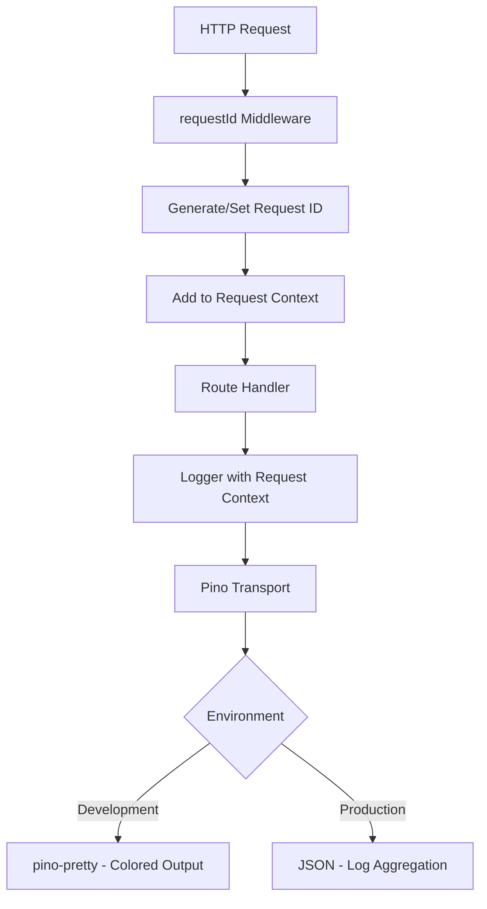

# Stage D: Structured Logging Plan (Pino)

## Overview
Replace all `console.log/warn/error` calls with Pino structured logging for better observability, debugging, and production monitoring.

## Architecture Diagram



## Implementation Steps

### Step 1: Install Dependencies
```bash
cd server
npm install pino pino-http
npm install -D pino-pretty @types/pino
```

### Step 2: Create Logger Utility
**File:** `server/src/utils/logger.ts`

Features:
- Single logger instance (singleton pattern)
- Child logger creation with request context
- Environment-aware configuration
- Request ID binding support

### Step 3: Create Request ID Middleware
**File:** `server/src/middleware/requestId.ts`

Features:
- Generate UUID for each incoming request
- Check for existing request ID from headers (for distributed tracing)
- Add to `req.id` and response headers
- Create child logger with request context

### Step 4: Update index.ts
- Add request ID middleware first (before other middleware)
- Add pino-http middleware
- Replace console calls in startup logic

### Step 5: Replace Console Calls (By Priority)

#### Priority 1: Core Routes (High Traffic)
- `server/src/routes/auth.ts` - 2 console calls
- `server/src/routes/companies.ts` - 5 console calls
- `server/src/routes/leases.ts` - 1 console call
- `server/src/routes/units.ts` - 1 console call

#### Priority 2: Supporting Routes
- `server/src/routes/blocks.ts` - 1 console call
- `server/src/routes/dashboard.ts` - 1 console call
- `server/src/routes/audit.ts` - 3 console calls
- `server/src/routes/users.ts` - 1 console call

#### Priority 3: Middleware & Services
- `server/src/middleware/errorHandler.ts` - 2 console calls
- `server/src/services/auditService.ts` - 1 console call

#### Priority 4: Infrastructure
- `server/src/index.ts` - 4 console calls
- `server/src/db/index.ts` - 2 console calls

### Step 6: Keep Scripts Console Intact
Files in `server/src/scripts/` should keep using console.log:
- `verify_audit_fix.ts`
- `test-manager-api.ts`
- `run-soft-delete-migration.ts`
- `reset-system.ts`
- `reproduce_error.ts`
- `check_*.ts` files
- `seed.ts`, `init.ts`, `verify.ts`, etc.

## Logger API Usage Examples

### Basic Usage
```typescript
import { logger } from './utils/logger';

// Info
logger.info({ userId: '123' }, 'User logged in');

// Error
logger.error({ err, userId: '123' }, 'Login failed');

// Warn
logger.warn({ rateLimit: '10/min' }, 'Rate limit approaching');

// Debug
logger.debug({ query: 'SELECT * FROM users' }, 'Executing query');
```

### With Request Context
```typescript
import { createLoggerWithReq } from './utils/logger';

app.get('/api/companies', (req, res) => {
    const log = createLoggerWithReq(req);
    log.info({ companyId: req.params.id }, 'Fetching company');
});
```

### Error Logging
```typescript
try {
    await someOperation();
} catch (err) {
    logger.error({ err, userId: req.user?.id }, 'Operation failed');
}
```

## Log Levels

| Level | Usage | Example |
|-------|-------|---------|
| `trace` | Very detailed debugging | Database query parameters |
| `debug` | Debugging information | Function entry/exit |
| `info` | Normal operation | User login, data fetch |
| `warn` | Warning conditions | Rate limit, deprecated usage |
| `error` | Error conditions | Failed operations, exceptions |
| `fatal` | Critical errors | Server cannot continue |

## Migration Strategy

### Safe Migration Approach
1. Create new logger utility (non-breaking)
2. Update one file at a time
3. Test after each file update
4. Keep server running throughout (nodemon will reload)

### Rollback Plan
If issues occur:
1. Logger falls back to console if misconfigured
2. Each file can be reverted independently
3. No database changes (safe to rollback)

## Configuration

### Development (.env)
```
LOG_LEVEL=debug
LOG_FORMAT=pretty
```

### Production
```
LOG_LEVEL=info
LOG_FORMAT=json
```

## Expected Output

### Development (Pretty)
```
[18:00:00.000] INFO (12345): User logged in
    userId: "abc123"
    ip: "127.0.0.1"
```

### Production (JSON)
```json
{
  "level": "info",
  "time": 1708128000000,
  "reqId": "abc-123-def",
  "userId": "abc123",
  "msg": "User logged in"
}
```

## Testing Checklist

- [ ] Logger works in development mode
- [ ] Logger works in production mode
- [ ] Request IDs propagate through the entire request
- [ ] Errors include stack traces
- [ ] All route handlers use logger
- [ ] Existing functionality unchanged
- [ ] Server starts without errors
- [ ] Scripts still use console.log (unchanged)

## Benefits

1. **Structured Data**: Logs are queryable in log aggregators
2. **Request Tracing**: Follow requests through the system
3. **Performance**: Pino is faster than console
4. **Production Ready**: JSON format for log management tools
5. **Debugging**: Rich context in every log entry
