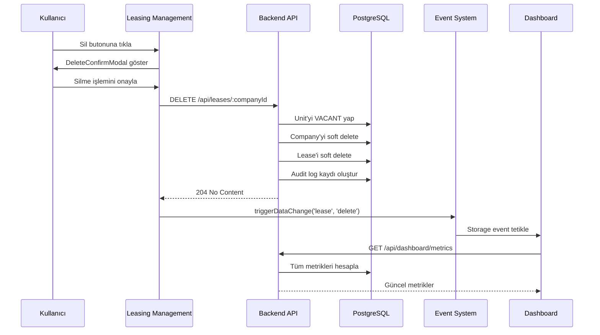
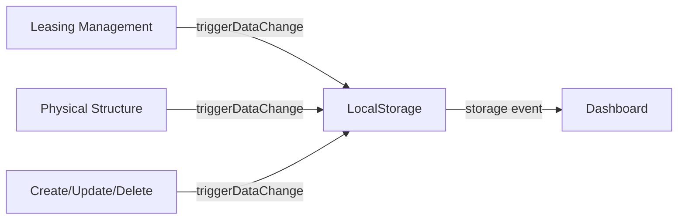
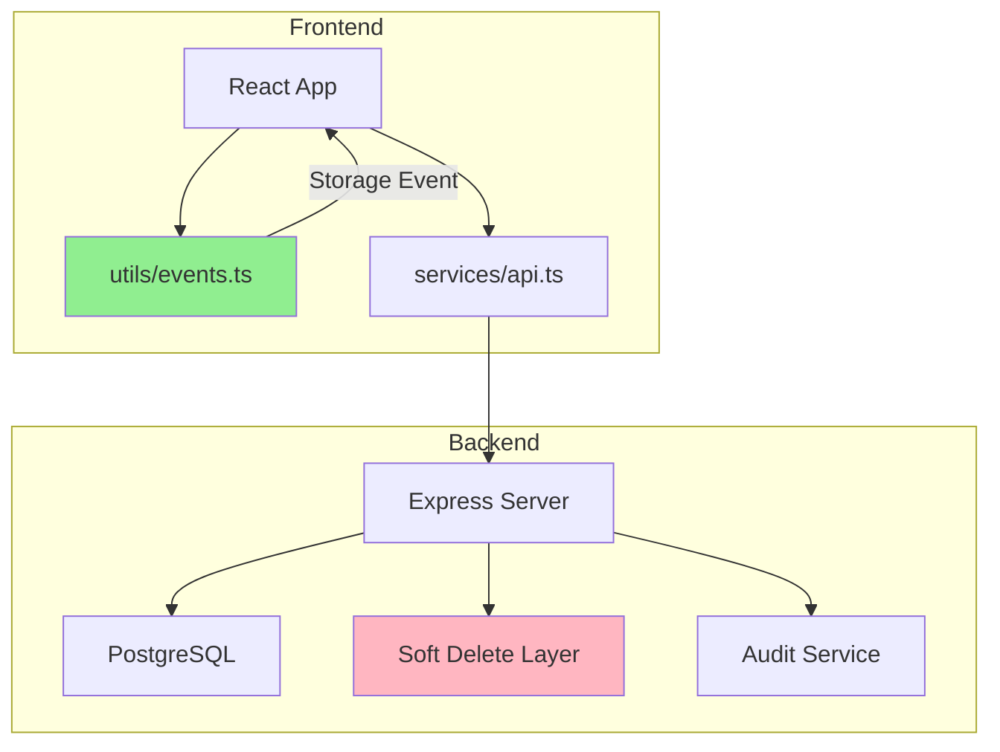
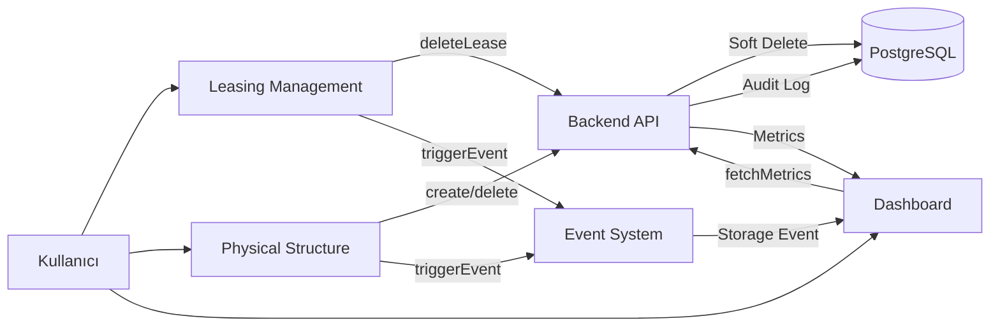

# Teknokent Yönetim Sistemi - Sistem Mimarisi Dökümantasyonu

## 1. Genel Bakış

Teknokent Yönetim Sistemi, React + TypeScript tabanlı frontend ve Express.js + PostgreSQL tabanlı backend kullanılarak geliştirilmiştir. Sistem, kampüs, blok, ofis/ünite ve firma kiralamalarını yönetmek için tasarlanmıştır.

### Teknoloji Stack

**Frontend:**
- React 18 with TypeScript
- Vite (Build Tool)
- React Router (HashRouter)
- Recharts (Data Visualization)
- Framer Motion (Animations)

**Backend:**
- Express.js + TypeScript
- PostgreSQL (Database)
- JWT Authentication
- Role-Based Access Control (RBAC)

---

## 2. Sözleşme Silme ve Dashboard Güncellenmesi

### 2.1 İş Akış Diyagramı



### 2.2 Detaylı İşleyiş

#### Adım 1: Kullanıcı Etkileşimi
```typescript
// LeasingManagement.tsx
const handleConfirmDelete = async () => {
  await api.deleteLease(deleteModal.companyId);
  fetchData();
  triggerDataChange('lease', 'delete'); // Dashboard için olay tetikle
};
```

#### Adım 2: Backend İşlemi
```typescript
// server/src/routes/leases.ts
router.delete('/:companyId', requireRole(['ADMIN', 'MANAGER']), async (req, res) => {
  return await transaction(async (client) => {
    // 1. Unit'yi VACANT yap
    await client.query(
      'UPDATE units SET company_id = NULL, status = VACANT WHERE company_id = $1',
      [companyId]
    );
    
    // 2. Lease'i soft delete (deleted_at timestamp)
    await client.query(
      'UPDATE leases SET deleted_at = CURRENT_TIMESTAMP WHERE company_id = $1',
      [companyId]
    );
    
    // 3. Company'yi soft delete
    await client.query(
      'UPDATE companies SET deleted_at = CURRENT_TIMESTAMP WHERE id = $1',
      [companyId]
    );
    
    // 4. İlişkili kayıtları soft delete
    await client.query(
      'UPDATE company_documents SET deleted_at = CURRENT_TIMESTAMP WHERE company_id = $1',
      [companyId]
    );
    await client.query(
      'UPDATE company_score_entries SET deleted_at = CURRENT_TIMESTAMP WHERE company_id = $1',
      [companyId]
    );
  });
});
```

#### Adım 3: Olay Tabanlı Bildirim (Event-Based Notification)
```typescript
// utils/events.ts
export function triggerDataChange(type: DataType, action: ActionType): void {
  const event = { type, action, timestamp: Date.now() };
  localStorage.setItem(DATA_CHANGE_EVENT, JSON.stringify(event));
  localStorage.removeItem(DATA_CHANGE_EVENT); // Storage event'i tetikler
}
```

#### Adım 4: Dashboard Güncellemesi
```typescript
// pages/Dashboard.tsx
useEffect(() => {
  const unsubscribe = listenForDataChanges((data) => {
    console.log('Dashboard: Data change detected', data);
    fetchData(); // Metrikleri anında yenile
  });
  return unsubscribe;
}, []);
```

#### Adım 5: Metrik Hesaplama
```typescript
// server/src/routes/dashboard.ts
router.get('/', async (req, res) => {
  // Soft delete filtresi: deleted_at IS NULL
  
  // Kullanılan Alan (usedArea)
  const usedSqM = await query(`
    SELECT SUM(u.area_sqm) 
    FROM units u 
    INNER JOIN companies c ON u.company_id = c.id 
    WHERE u.status = 'OCCUPIED' 
    AND c.deleted_at IS NULL 
    AND u.deleted_at IS NULL
  `);
  
  // Toplam Firma Sayısı (totalCompanies)
  const companyCount = await query(`
    SELECT COUNT(*) FROM companies WHERE deleted_at IS NULL
  `);
  
  // Toplam Gelir (revenue)
  const totalRevenue = await query(`
    SELECT SUM(l.rent_per_sqm * u.area_sqm) 
    FROM leases l 
    JOIN units u ON u.company_id = l.company_id 
    WHERE l.deleted_at IS NULL 
    AND u.deleted_at IS NULL
  `);
});
```

### 2.3 Metrik Güncelleme Etkisi

| Metrik | Değişim |
|--------|---------|
| **Kullanılan Alan (usedArea)** | Azalır |
| **Boş Alan (emptyArea)** | Artar |
| **Doluluk Oranı (occupancyRate)** | Azalır |
| **Toplam Firma Sayısı (totalCompanies)** | 1 azalır |
| **Toplam Gelir (totalRevenue)** | Silinen sözleşmenin kirası kadar azalır |
| **Sektör Dağılımı (sectorData)** | Güncellenir |

---

## 3. Arama Çubuğu İşleyiş Mantığı

### 3.1 Leasing Management Arama

#### Kapsam
Firma Adı, Yönetici Adı, Sektör, İş Alanı Etiketleri

#### Implementasyon
```typescript
// pages/LeasingManagement.tsx
const filteredLeases = useMemo(() => {
  let res = allLeases;
  
  // Kampüs filtresi
  if (filterCampus !== 'ALL') 
    res = res.filter(l => l.campus.id === filterCampus);
  
  // Blok filtresi
  if (filterBlock !== 'ALL') 
    res = res.filter(l => l.block.id === filterBlock);
  
  // Kat filtresi
  if (filterFloor !== 'ALL') 
    res = res.filter(l => l.unit.floor === filterFloor);
  
  // Durum filtresi
  if (filterStatus !== 'ALL') 
    res = res.filter(l => filterStatus === 'OCCUPIED' ? l.unit.company_id : !l.unit.company_id);
  
  // Arama çubuğu (case-insensitive)
  if (searchQuery) {
    const q = searchQuery.toLowerCase();
    res = res.filter(l => 
      l.company.name.toLowerCase().includes(q) ||
      l.company.managerName?.toLowerCase().includes(q) ||
      l.company.sector.toLowerCase().includes(q) ||
      l.company.businessAreas?.some((tag: string) => tag.toLowerCase().includes(q))
    );
  }
  
  // İş Alanı Etiketleri filtresi (AND mantığı)
  if (selectedBusinessTags.length > 0) {
    res = res.filter(l => 
      selectedBusinessTags.every(tag => l.company.businessAreas?.includes(tag))
    );
  }
  
  return res;
}, [allLeases, filterCampus, filterBlock, filterFloor, filterStatus, searchQuery, selectedBusinessTags]);
```

### 3.2 Physical Structure Arama

#### Kapsam
Tüm kampüslerdeki firmaların Adı, Sektörü, Yönetici Adı

#### Implementasyon
```typescript
// pages/PhysicalStructure.tsx
const globalSearchResults = useMemo(() => {
  if (globalSearch.length < 2) return [];
  
  const q = globalSearch.toLowerCase();
  const results: any[] = [];
  
  campuses.forEach(campus => {
    const campusBlocks = blocks.filter(b => b.campus_id === campus.id);
    
    campusBlocks.forEach(block => {
      const blockUnits = units.filter(u => u.block_id === block.id && u.company_id);
      
      blockUnits.forEach(unit => {
        const company = allCompanies.find(c => c.id === unit.company_id);
        if (!company || company.deleted_at) return;
        
        const matches = 
          company.name.toLowerCase().includes(q) ||
          company.sector.toLowerCase().includes(q) ||
          company.managerName?.toLowerCase().includes(q);
        
        if (matches) {
          results.push({ company, block, unit, campus });
        }
      });
    });
  });
  
  return results;
}, [globalSearch, campuses, blocks, units, allCompanies]);
```

#### Sonuç Etkileşimi
```typescript
const handleSearchResultClick = async (campus: Campus, blockId: string, unitId: string) => {
  // 1. Kampüs değiştir
  if (selectedCampus?.id !== campus.id) {
    await handleSelectCampus(campus);
  }
  
  // 2. Bloğu seç
  setSelectedBlockId(blockId);
  
  // 3. Sayfayı kaydır ve vurgula
  setTimeout(() => {
    const element = document.getElementById(`unit-${unitId}`);
    if (element) {
      element.scrollIntoView({ behavior: 'smooth', block: 'center' });
      element.classList.add('highlighted-unit');
      setTimeout(() => element.classList.remove('highlighted-unit'), 3000);
    }
  }, 300);
};
```

#### Güvenlik
```typescript
// utils/format.ts - sanitizeInput fonksiyonu
const sanitizeInput = (input: any): any => {
  if (typeof input === 'string') {
    return input.trim().replace(/<[^>]*>/g, ''); // XSS koruması
  }
  // ... recursive sanitization
};
```

---

## 4. Event-Driven Mimari

### 4.1 Event Türleri

```typescript
export type DataType = 'company' | 'lease' | 'campus' | 'block' | 'unit' | 'document' | 'score';
export type ActionType = 'create' | 'update' | 'delete';
```

### 4.2 Event Flow



### 4.3 Event Trigger Noktaları

| Sayfa | İşlem | Event |
|-------|-------|-------|
| Leasing Management | Firma oluştur | `triggerDataChange('company', 'create')` |
| Leasing Management | Sözleşme sil | `triggerDataChange('lease', 'delete')` |
| Physical Structure | Kampüs oluştur | `triggerDataChange('campus', 'create')` |
| Physical Structure | Kampüs sil | `triggerDataChange('campus', 'delete')` |
| Physical Structure | Blok oluştur | `triggerDataChange('block', 'create')` |
| Physical Structure | Ünite ata | `triggerDataChange('unit', 'update')` |
| Physical Structure | Ünite kaldır | `triggerDataChange('unit', 'update')` |

---

## 5. Soft Delete Mimarisi

### 5.1 Veritabanı Şeması

Tüm ana tablolarda `deleted_at TIMESTAMP WITH TIME ZONE DEFAULT NULL` alanı bulunur:

```sql
-- Soft delete ile silinen kayıtlar
SELECT * FROM companies WHERE deleted_at IS NOT NULL;

-- Aktif kayıtlar
SELECT * FROM companies WHERE deleted_at IS NULL;

-- Index performansı için
CREATE INDEX idx_companies_deleted_at 
ON companies(deleted_at) WHERE deleted_at IS NOT NULL;
```

### 5.2 Restore Endpoints

```typescript
// server/src/routes/restore.ts

// Kampüs restore
POST /api/restore/campuses/:id

// Blok restore
POST /api/restore/blocks/:id

// Ünite restore
POST /api/restore/units/:id

// Firma restore (cascade: documents, scores)
POST /api/restore/companies/:id

// Sözleşme restore (cascade: company, documents, scores)
POST /api/restore/leases/:companyId

// Tüm silinenleri listele
GET /api/restore/all
```

---

## 6. API Endpoint Özeti

### 6.1 Leasing Endpoints

```
GET    /api/leases                    - Tüm sözleşmeleri listele
GET    /api/leases/details            - Detaylı sözleşme listesi
PUT    /api/leases/:companyId         - Sözleşme güncelle
DELETE /api/leases/:companyId         - Sözleşme sil (soft delete)
```

### 6.2 Dashboard Endpoints

```
GET    /api/dashboard                 - Tüm metrikleri getir
```

### 6.3 Company Endpoints

```
GET    /api/companies                 - Tüm firmaları listele
GET    /api/companies/:id             - Firma detayı
POST   /api/companies                 - Yeni firma oluştur
PUT    /api/companies/:id             - Firma güncelle
DELETE /api/companies/:id             - Firma sil (soft delete)
POST   /api/companies/:id/documents   - Doküman ekle
DELETE /api/companies/:id/documents/:docName - Doküman sil
POST   /api/companies/:id/scores      - Skor ekle
DELETE /api/companies/:id/scores/:scoreId - Skor sil
```

---

## 7. Güvenlik

### 7.1 XSS Koruması
- Tüm kullanıcı girdileri `sanitizeInput()` fonksiyonundan geçer
- React'in otomatik XSS escape mekanizması kullanılır

### 7.2 Kimlik Doğrulama
- JWT token tabanlı authentication
- Token'lar localStorage'da saklanır
- Her API isteğinde `Authorization: Bearer <token>` header'ı gönderilir

### 7.3 Yetkilendirme (RBAC)
- **ADMIN**: Tüm işlemler
- **MANAGER**: CRUD işlemleri (delete hariç bazı kısıtlamalar)
- **USER**: Sadece okuma

---

## 8. Performans Optimizasyonları

### 8.1 Database Indexes
```sql
-- Performans için kritik indexler
CREATE INDEX idx_units_company_id ON units(company_id) WHERE deleted_at IS NULL;
CREATE INDEX idx_units_block_id ON units(block_id) WHERE deleted_at IS NULL;
CREATE INDEX idx_leases_company_id ON leases(company_id) WHERE deleted_at IS NULL;
CREATE INDEX idx_companies_sector ON companies(sector) WHERE deleted_at IS NULL;
```

### 8.2 Frontend Optimizasyonları
- `useMemo` ile pahalı hesaplamalar cache'lenir
- `React.memo` ile unnecessary re-renders önlenebilir
- Virtual scrolling için `AnimatedList` component'i

### 8.3 API Optimizasyonları
- Cache middleware ile sık kullanılan endpoint'ler cache'lenir
- Pagination ile büyük veri setleri parçalı yüklenir

---

## 9. Sonraki Aşamalar (Phase 3 Devam)

### Stage D: Structured Logging
- Pino logger entegrasyonu
- Request ID middleware
- Log rotation ve retention

### Stage E: Test Infrastructure
- Jest + Supertest
- Unit ve integration testler
- Test database kurulumu

### Stage F: CI/CD Pipeline
- GitHub Actions workflows
- Automated testing ve deployment
- Branch protection rules

### Stage G: Docker Support
- Multi-stage Dockerfile
- docker-compose.yml
- Development ve production configurations

---

## 10. Mimari Diyagramlar

### 10.1 Güncel Mimari



### 10.2 Veri Akışı



---

Bu dökümantasyon, sistemin güncel mimarisini ve işleyişini detaylı bir şekilde açıklamaktadır.
